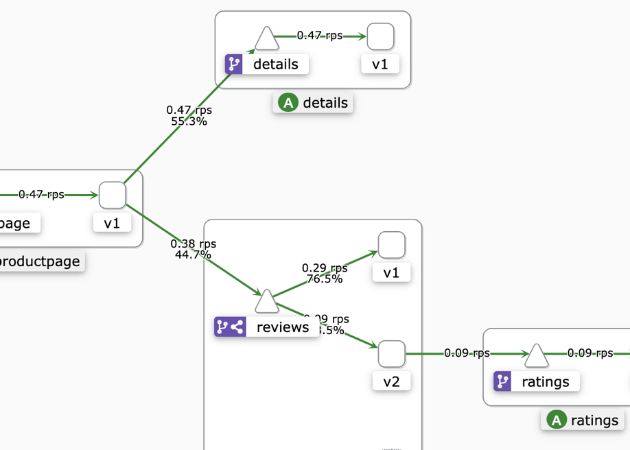
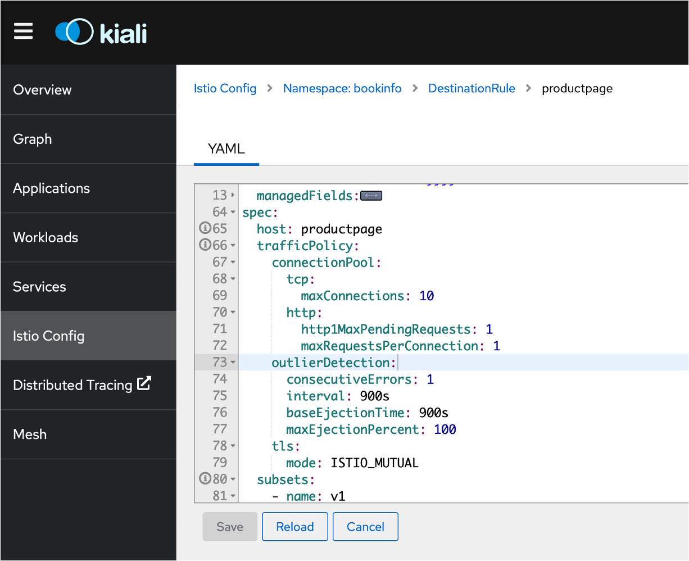

# Resilience Patterns, Service Mesh  & Chaos Testing 

This tutorial walks you through how to install Red Hat OpenShift Service Mesh alongside microservices for a sample app called BookInfo on a Redhat OpenShift cluster. You will also learn how to configure an `Istio` ingress-gateway to expose a service outside of the service mesh, perform traffic management to set up important tasks like `A/B testing` and `canary deployments`, **secure** your microservice communication and use of metrics, logging and tracing to **observe** services, and get started with **Chaos engineering**!

Based on the open source Istio project, Red Hat OpenShift Service Mesh adds a transparent layer on existing distributed applications. Red Hat OpenShift Service Mesh provides a platform for behavioral insight and operational control over your networked microservices in a service mesh. 

[Istio](https://www.ibm.com/think/topics/istio) is an open platform to connect, secure, control and observe microservices, also known as a service mesh, on cloud platforms such as Kubernetes and Red Hat OpenShift.

**Cloud Design Patterns** must be used in every app design to enhance  resilience and availability, and you basically have several  alternatives: 
1. Use a **service mesh**. In a service mesh, you put all the reporting, routing, policies, security logic in sidecar proxies, injected transparently into your application pods. The business logic remains in the code of the application, no changes are required to the application code.

2. Implement the required functionality **in the application code**. Most of the functionality is already available in various libraries, for example in the `Netflix’s Hystrix library` for the Java programming language. However, now you have to change your code to use the libraries. You have to put additional effort, your code will bloat, business logic will be mixed with reporting, routing, policies, networking logic. Since your microservices use different programming languages, you have to learn, use, update multiple libraries.

See [The Istio service mesh](https://istio.io/latest/about/service-mesh/) to learn how Istio can perform the tasks mentioned here and more. In this lab, you will explore various Istio features.

-  *Fig. Chaos Engineering , break things before they break!* 
 <p>
 
</p>

## Objectives

-   Install Red Hat OpenShift Service Mesh in your cluster
-   Deploy the BookInfo sample app
-   Use metrics, logging and tracing to observe services
-   Set up the Istio Ingress Gateway
-   Perform simple traffic management, such as A/B tests and canary deployments
-   Get started with Fault injection and Chaos Testing


1. `Admin` (you) provisions a Red Hat OpenShift cluster (if not already one) and installs the Service Mesh Operator along with other Telemetry Operators.
2. `Admin` creates an `istio-system-teamX` namespace(project) and creates `ServiceMeshControlPlane`. `X` is your team number.
3. `Admin` creates a `bookinfo-teamX` namespace with automatic sidecar injection enabled and deploys the BookInfo app (with four separate microservices) in to the Service Mesh.
4. `Admin` exposes the app for external traffic with the Istio Ingress Gateway (optional).
5. The user securely (HTTPS) accesses the application via browser.
6. `Admin` monitors the health and performance of the microservices using the metrics, traces, logs, and perform fault injection tasks.

### Access the cluster

From your **terminal**, create a project called `bookinfo-teamX` with `oc new-project` command. The project will hold the application created after installing the service mesh.
```
oc new-project bookinfo-teamX
```
## Step 1: Install Service Mesh - Istio

In this section, you will install Service Mesh - Istio on the cluster. Installing the Service Mesh involves installing the `Elasticsearch`, `Jaeger`, `Kiali` and `Service Mesh` Operators, creating and managing a `ServiceMeshControlPlane` resource to deploy the control plane, and creating a `ServiceMeshMemberRoll` resource to specify the namespaces associated with the Service Mesh.

Note: Some of the projects have multiple operators. Be careful to install the ones specified below :

**Elasticsearch** - Based on the open source Elasticsearch project that enables you to configure and manage an Elasticsearch cluster for tracing and logging with Jaeger.

**Jaeger** - Based on the open source Jaeger project, lets you perform tracing to monitor and troubleshoot transactions in complex distributed systems.

**Kiali** - Based on the open source Kiali project, provides observability for your service mesh. By using Kiali you can view configurations, monitor traffic, and view and analyze traces in a single console.

**Red Hat OpenShift Service Mesh** - Based on the open source Istio project, lets you connect, secure, control, and observe the microservices that make up your applications.

### Install the Operators // Skip this step

The cluster admin has already installed those operators for you , in the default `openshift-operators` project and makes the Operators available to all projects in the cluster. Please skip but review the following instructions: 

1.  On the left pane of **Red Hat OpenShift web console**, select **Administrator** in the drop down.
2.  Select **Operators** and then **OperatorHub**.
3.  Search for **OpenShift Elasticsearch Operator**, click on the tile, click on **Install**, leave the default selection and click on **Install**.
4.  **Repeat** the above steps 2 and 3 for installing Operators,
    1.  **Red Hat OpenShift distributed tracing platform**
    2.  **Kiali Operator** (provided by Red Hat)
    3.  **Red Hat OpenShift Service Mesh** .
   
   

### Deploying the Red Hat OpenShift Service Mesh control plane

The Red Hat OpenShift Service Mesh operator uses a `ServiceMeshControlPlane` resource to determine how to install Istio and what components you want. Let's create that resource now.

1.  Create a new project by going to **Home** on the left pane of the web console, click **Projects** and then **Create Project**.
2.  Enter `istio-system-teamX` in the **Name** and click **Create**.
3.  Navigate to **Operators** and click **Installed Operators**.
4.  Select `istio-system-teamX` from the Project menu on the top bar.
5.  Click on **Red Hat OpenShift Service Mesh**. If you don't see it, wait a couple of minutes and refresh.
6.  On the Details tab, under **Istio Service Mesh Control Plane** tile, click **Create Instance** or **Create ServiceMeshControlPlane**.
7.  Then, click **Create**. _The Operator creates Pods, services, and Service Mesh control plane components based on your configuration parameters._
8.  To make sure that the Service Mesh Control Plane is installed properly, click on **basic** under `Name` in the list. On the subsequent page, you should see **Components** ready. Moreover, when you scroll to the **Conditions** section of the page, you should see the reason `ComponentsReady` and a message `All component deployments are Available`.

### Create a ServiceMeshMemberRoll

`ServiceMeshMemberRoll` resource is used to to specify the namespaces associated with the Service Mesh.

1.  Navigate to **Operators** → **Installed Operators** again.
2.  Click on **Red Hat OpenShift Service Mesh**.
3.  On the Details tab, under **Istio Service Mesh Member Roll** tile, click **Create Instance** or **Create ServiceMeshMemberRoll** and then select **YAML View**
4.  Change `your-project` to `bookinfo-teamX` and delete the last line(`- another-of-your-projects`). After the edits, the YAML should look something like this:
  ```yaml
    apiVersion: maistra.io/v1
    kind: ServiceMeshMemberRoll
    metadata:
      name: default
      namespace: istio-system-teamX
    spec:
      members:
        - bookinfo-teamX
   ```
    
   
2.  Then, click **Create**.

You successfully installed Istio into your cluster.

## Step 2: Deploy the BookInfo application on Service Mesh

The [BookInfo application](https://istio.io/latest/docs/examples/bookinfo/) displays information about a book, similar to a single catalog entry of an online book store. Displayed on the page is a description of the book, book details (ISBN, number of pages, and so on), and a few book reviews.

The Bookinfo application is broken into four separate microservices:

-   **productpage**. The productpage microservice calls the details and reviews microservices to populate the page.
-   **details**. The details microservice contains book information.
-   **reviews**. The reviews microservice contains book reviews. It also calls the ratings microservice.
-   **ratings**. The ratings microservice contains book ranking information that accompanies a book review.

There are 3 versions of the reviews microservice:

-   Version v1 doesn’t call the ratings service.
-   Version v2 calls the ratings service, and displays each rating as 1 to 5 black stars.
-   Version v3 calls the ratings service, and displays each rating as 1 to 5 red stars.

The end-to-end architecture of the application is shown below.


*Fig. Bookinfo Architecture using Istio*

Red Hat OpenShift Service Mesh relies on the Envoy sidecars within the application’s pod to provide Service Mesh capabilities to the application. You can enable automatic sidecar injection or manage it manually. Automatic injection using the annotation is the recommended way.

1.  Deploy the Bookinfo application in the `bookinfo-teamX` project by applying the bookinfo.yaml file on to the Red Hat OpenShift cluster. This deploys all the microservice applications including versions v1, v2 and v3 of the reviews app.
    

`oc apply -f https://raw.githubusercontent.com/istio/istio/release-1.25/samples/bookinfo/platform/kube/bookinfo.yaml` 

IMPORTANT: The `bookinfo.yaml` file must be annotated with  `sidecar.istio.io/inject: "true"` on each `Deployment` to enable automatic injection of the Istio sidecar for Red Hat OpenShift Service Mesh. So, these pods will also include an Envoy sidecar as they are started in the cluster.


-   Tip: An installation of Red Hat OpenShift Service Mesh differs from upstream Istio community installations in multiple ways. Refer [this link](https://docs.openshift.com/container-platform/4.13/service_mesh/v2x/ossm-vs-community.html) comparing Service Mesh and Istio. 
By default, Istio injects the sidecar if you have labeled the project `istio-injection=enabled`. Red Hat OpenShift Service Mesh handles this differently and requires you to opt in to having the sidecar automatically injected to a deployment, so you are not required to label the project. This avoids injecting a sidecar if it is not wanted (for example, in build or deploy pods).

2. Edit each deployment with the missing `sidecar.istio.io/inject: "true"` annotation on each Deployment.
```yaml
apiVersion: apps/v1
kind: Deployment
metadata:
  name: details-v1
  labels:
    app: details
    version: v1
spec:
  replicas: 1
  template:
    metadata:
      labels:
        app: details
        version: v1
      annotations:
        sidecar.istio.io/inject: "true"  <<<<< line to add
        ...
```
3. Verify that the pods are up and running.
    

`oc get pods` 

**Sample output:**
```
NAME                              READY     STATUS    RESTARTS   AGE
details-v1-789c5f58f4-9twtw       2/2       Running   0          4m12s
productpage-v1-856c8cc5d8-xcx2q   2/2       Running   0          4m11s
ratings-v1-5786768978-tr8z9       2/2       Running   0          4m12s
reviews-v1-5874566865-mxfgm       2/2       Running   0          4m12s
reviews-v2-86865fc7d9-mf6t4       2/2       Running   0          4m12s
reviews-v3-8d4cbbbbf-rfjcz        2/2       Running   0          4m12s` 
```
1.  Tip: Note that each bookinfo pods has **2 containers** in it. One is the bookinfo container, and the other is the Envoy proxy sidecar.
    
Your bookinfo app is running, but you can't access it as the service is not yet configured to receive external traffic. In the next section, you will expose the `productpage` service to allow incoming traffic.

## Step 3: Expose the app with the Istio Ingress Gateway and Route

The components deployed on the service mesh by default are not exposed outside the cluster. An Ingress Gateway resource can be created to allow external requests through the Istio Ingress Gateway to the backing services.

1.  Configure the bookinfo default route with the Istio Ingress Gateway.
    
-   ```oc create -f https://raw.githubusercontent.com/bmarolleau/cdp-mesh-tutorial/refs/heads/main/samples/istio/bookinfo/bookinfo-gateway.yaml```
    
-   Get the **ROUTE** of the Istio Ingress Gateway.
    
-   `oc get routes -n istio-system-teamX istio-ingressgateway` 
    
-   Save the HOST address that you retrieved in the previous step, as it will be used to access the BookInfo app in later parts of the tutorial. Create an environment variable called `$INGRESS_HOST` with your HOST address.
    
```
INGRESS_HOST=$(oc get route -n istio-system-teamX | grep istio-ingressgateway | awk ' { print $2"/productpage" }')
```    
 Visit the application by going to `http://$INGRESS_HOST/productpage` in a new tab. If you keep hitting Refresh, you should see different versions of the page in random order (v1 - no stars, v2 - black stars, v3 - red stars). **_Keep that browser tab open for later_**.

## Step 4: Observe service telemetry: metrics and tracing

Istio's tracing and metrics features are designed to provide broad and granular insight into the health of all services. Istio's role as a service mesh makes it the ideal data source for observability information, particularly in a microservices environment. As requests pass through multiple services, identifying performance bottlenecks becomes increasingly difficult using traditional debugging techniques. Distributed tracing provides a holistic view of requests transiting through multiple services, allowing for immediate identification of latency issues. With Istio, distributed tracing comes by default. This will expose latency, retry, and failure information for each hop in a request.

### Visualize Metrics with Grafana

Grafana allows you to query, visualize, alert on and understand your metrics no matter where they are stored.

1.  In the **Red Hat OpenShift on IBM Cloud web console**,
    
    1.  On the left pane, under **Networking**, click on **Routes**
    
    2.  Select Project: **istio-system** from the top bar
    3.  Click the URL(Location) next to **grafana**
    4.  Log into Red Hat OpenShift on IBM Cloud and allow the requested permissions to see the Grafana dashboard.
2.  Click the **Dashboard** menu in the left navigation panel, select the **Manage** tab, then **istio** and **Istio Service Dashboard**.
    
3.  Select `productpage.bookinfo.svc.cluster.local` in the **Service** drop down.
    
4.  Go to your Shell tab/window and generate a small load to the app by sending traffic to the Ingress host location you set in the last section.
    

  `for i in {1..20}; do sleep 0.5; curl -I $INGRESS_HOST/productpage; done` 
    

Open each twisty to see more of the dashboard. Choose different services in the **Service** drop down. This Grafana dashboard provides metrics for each workload. Explore the other dashboards provided as well.


### Observe your Service mesh with Kiali

Kiali is an open-source project that installs as an add-on on top of Istio to visualize your service mesh. Kiali provides deeper insight into how your microservices interact with one another, and provides features such as circuit breakers and request rates for your services.

1.  From the **Red Hat OpenShift on IBM Cloud web console**,
    1.  On the left pane, Under **Networking** and then click **Routes**
    2.  select **istio-system** as your project from the top bar
    3.  Click the URL(Location) next to **kiali** and if prompted, click **Login with OpenShift**
2.  Click the **Graph** on the left pane and select the `bookinfo` and `istio-system` namespaces from the top bar to see the a visual **Versioned app graph** of the various services in your Istio mesh.
3.  To see the request rates, click **Display** and choose **Traffic Rate**.
4.  In a different tab/window, visit the BookInfo application URL and refresh the page multiple times to generate some load, or run the load script in the previous section to generate load.
5.  Now, check the Kiali Graph to see the requests per second.

Kiali has a number of views to help you visualize your services. Click through the various tabs to explore the service graph, and the various views for workloads, applications and services.


## Step 5: Perform traffic management

Istio’s traffic routing rules let you easily control the flow of traffic and API calls between services. Istio simplifies configuration of service-level properties like circuit breakers, timeouts, and retries, and makes it easy to set up important tasks like A/B testing, canary rollouts, and staged rollouts with percentage-based traffic splits. It also provides out-of-box failure recovery features that help make your application more robust against failures of dependent services or the network.

Istio’s traffic management model relies on the Envoy proxies (sidecars) that are deployed along with your services. All traffic that your services send and receive (data plane traffic) is proxied through Envoy, making it easy to direct and control traffic around your mesh without making any changes to your services.

Pilot translates high-level rules into low-level configurations and distributes this config to Envoy instances. Pilot uses three types of configuration resources to manage traffic within its service mesh: [Virtual Services](https://istio.io/latest/docs/reference/config/networking/virtual-service/), [Destination Rules](https://istio.io/latest/docs/reference/config/networking/destination-rule/), and [Service Entries](https://istio.io/latest/docs/reference/config/networking/service-entry/).

### A/B testing with Istio

A/B testing is a method of performing identical tests against two separate service versions in order to determine which performs better. To prevent Istio from performing the default routing behavior between the original and modernized service, define the following rules:

1.  Run the following command to create default destination rules for the Bookinfo services,
    
```bash
oc create -f https://raw.githubusercontent.com/bmarolleau/cdp-mesh-tutorial/refs/heads/main/samples/istio/bookinfo/destination-rule-all.yaml
```

-   Tip: A [DestinationRule](https://istio.io/latest/docs/reference/config/networking/virtual-service/#Destination) defines policies that apply to traffic intended for a service after routing has occurred. These rules specify configuration for load balancing, connection pool size from the sidecar, and outlier detection settings to detect and evict unhealthy hosts from the load balancing pool. Any destination `host` and `subset` referenced in a `VirtualService` rule must be defined in a corresponding `DestinationRule`.
    
-   A VirtualService defines a set of traffic routing rules to apply when a host is addressed. Each routing rule defines matching criteria for traffic of a specific protocol. If the traffic is matched, then it is sent to a named destination service (or subset/version of it) defined in the registry. Run the below command to send all reviews traffic to v1:
    

```yaml
oc create -f https://raw.githubusercontent.com/bmarolleau/cdp-mesh-tutorial/refs/heads/main/samples/istio/bookinfo/virtual-service-all-v1.yaml
```

-   Tip: The `VirtualService` defines a rule that captures all HTTP traffic coming in to reviews service, and routes 100% of the traffic to pods of the service with label "version: v1". A subset or version of a route destination is identified with a reference to a named service subset which must be declared in a corresponding `DestinationRule`.
    
-   View the bookinfo application in your browser tab. You should only get the v1 of the BookInfo application, i.e., no stars for ratings.
    
-   To enable the Istio service mesh for A/B testing against the new service version, modify the original `VirtualService` rule to send only Firefox traffic to v2. You may change the `user-agent` to any other installed browser on your machine:
    

```yaml
cat <<EOF | oc replace -f -
apiVersion: networking.istio.io/v1alpha3
kind: VirtualService
metadata:
  name: reviews
spec:
  hosts:
  - reviews
  http:
  - match:
    - headers:
        user-agent:
          regex: '.*Firefox.*'
    route:
    - destination:
        host: reviews
        subset: v2
  - route:
    - destination:
        host: reviews
        subset: v3
EOF
```

1.  Tip: In Istio `VirtualService` rules, there can be only one rule for each service and therefore when defining multiple [HTTPRoute](https://istio.io/latest/docs/reference/config/networking/virtual-service/#HTTPRoute) blocks, the order in which they are defined in the yaml matters. Hence, the original `VirtualService` rule is modified rather than creating a new rule. With the modified rule, incoming requests originating from `Firefox` browsers will go to the v2 version(Black stars) of bookinfo. All other requests fall-through to the next block, which routes all traffic to the v3(Red Stars) version of bookinfo.

    
    

### Canary deployment

In Canary deployments, newer versions of services are incrementally rolled out to users to minimize the risk and impact of any bugs introduced by the newer version. To begin incrementally routing traffic to the newer version of the bookinfo service, modify the original `VirtualService` rule:

1.  Run the below command to send 80% of traffic to v1,
    

```bash
oc replace -f https://raw.githubusercontent.com/bmarolleau/cdp-mesh-tutorial/refs/heads/main/samples/istio/bookinfo/virtual-service-reviews-80-20.yaml
``` 

Tip: In the modified rule, the routed traffic is split between two different subsets of the reviews microservice. In this manner, traffic to the modernized version 2 of reviews is controlled on a percentage basis to limit the impact of any unforeseen bugs. This rule can be modified over time until eventually all traffic is directed to the newer version of the service.
    
2. View the bookinfo application again in your browser tab. Ensure that you are using a hard refresh (command + Shift + R on Mac or Ctrl + F5 on windows) to remove any browser caching. You should notice that the bookinfo application should swap between V1 or V2 at about the weight you specified.

    
3. To route all traffic to reviews v3: 
```
oc replace -f https://raw.githubusercontent.com/bmarolleau/cdp-mesh-tutorial/refs/heads/main/samples/istio/bookinfo/virtual-service-reviews-v3.yaml
```

Reset the `reviews` virtual service :
````yaml
cat <<EOF | oc replace -f -
apiVersion: networking.istio.io/v1alpha3
kind: VirtualService
metadata:
  name: reviews
spec:
  hosts:
  - reviews
  http:
  - route:
    - destination:
        host: reviews
EOF
````


### Circuit breaker
Référence:  [https://istio.io/latest/docs/tasks/traffic-management/circuit-breaking/](https://istio.io/latest/docs/tasks/traffic-management/circuit-breaking/)

-   Update the `productpage` DestinationRule with Circuit breaking logic: 

````yaml
cat <<EOF | oc replace -f -
# Places some circuit breaking logic on productpage
apiVersion: networking.istio.io/v1alpha3
kind: DestinationRule
metadata:
  name: productpage
spec:
  host: productpage
  trafficPolicy:
    tls:
      mode: ISTIO_MUTUAL
    connectionPool:
      tcp:
        maxConnections: 1
      http:
        http1MaxPendingRequests: 1
        maxRequestsPerConnection: 1
  subsets:
  - name: v1
    labels:
      version: v1
EOF
````

-   Check that the Circuit Breaker is applied in your service from Kiali: 


-   Complexify a bit with advanced circuit breaking and outlier detection
1.  If found error 1 times (`consecutiveErrors`) 
2. then eject that pod from pool for 15 mintues (`baseEjectionTime`)
3. Maximum number of pod that can be ejected is 100% (`maxEjectionPercent`)
4. Check this every 15 min (`interval`)
`OutlierDetection` refers to the doc:  [OutlierDetection](https://istio.io/latest/docs/reference/config/networking/destination-rule/#OutlierDetection) 


````yaml
cat <<EOF | oc replace -f -
# Places some circuit breaking logic on productpage
apiVersion: networking.istio.io/v1alpha3
kind: DestinationRule
metadata:
  name: productpage
spec:
  host: productpage
  trafficPolicy:
    connectionPool:
      tcp:
        maxConnections: 10
      http:
        http1MaxPendingRequests: 1
        maxRequestsPerConnection: 1
    outlierDetection:
      consecutiveGatewayErrors: 1
      interval: 900s
      baseEjectionTime: 900s
      maxEjectionPercent: 100
  subsets:
  - name: v1
    labels:
      version: v1
EOF
````


-   Inject a workload and play with the settings. In real life a workload simulation tool can be used like `jmeter` or equivalent, but a simple curl can also do the job in simple cases.
`while true; do curl -I -s  $INGRESS_HOST/productpage;sleep 1; done`


## Step 6 - Chaos Testing / Fault Injection

This task shows you how to inject faults to test the resiliency of your application.

-  Apply application version routing by running the following commands: 

1. (re)Initialize the following `VirtualService`resources to use v1 only: 
```bash
oc replace -f https://raw.githubusercontent.com/bmarolleau/cdp-mesh-tutorial/refs/heads/main/samples/istio/bookinfo/virtual-service-all-v1.yaml
```

2. Add specific rule for user `jason` : 
```yaml
cat <<EOF | oc replace -f -
apiVersion: networking.istio.io/v1
kind: VirtualService
metadata:
  name: reviews
spec:
  hosts:
    - reviews
  http:
  - match:
    - headers:
        end-user:
          exact: jason
    route:
    - destination:
        host: reviews
        subset: v2
  - route:
    - destination:
        host: reviews
        subset: v1
EOF
```
With the above configuration, this is how requests flow:
•	productpage → reviews:v2 → ratings (only for user jason)
•	productpage → reviews:v1 (for everyone else)

3. Test the applied configuration. With user `jason` and with other users.


### Injecting an HTTP delay fault


To test the Bookinfo application microservices for resiliency, inject a 7s delay between the `reviews:v2` and `ratings` microservices for user `jason`. This test will uncover a bug that was intentionally introduced into the Bookinfo app.


Note that the `reviews:v2` service has a 10s hard-coded connection timeout for calls to the `ratings` service. Even with the 7s delay that you introduced, you still expect the end-to-end flow to continue without any errors.

1. Create a fault injection rule to delay traffic coming from the test user jason.

```yaml
cat <<EOF | oc replace -f -
apiVersion: networking.istio.io/v1
kind: VirtualService
metadata:
  name: ratings
spec:
  hosts:
  - ratings
  http:
  - match:
    - headers:
        end-user:
          exact: jason
    fault:
      delay:
        percentage:
          value: 100.0
        fixedDelay: 7s
    route:
    - destination:
        host: ratings
        subset: v1
  - route:
    - destination:
        host: ratings
        subset: v1
EOF
```
```
oc get virtualservice ratings -o yaml
```

### Testing the delay configuration

- Open the Bookinfo web application in your browser.
- On the /productpage web page, log in as user jason.

You expect the Bookinfo home page to load without errors in approximately 7 seconds. However, there is a problem: the Reviews section displays an error message:

```Sorry, product reviews are currently unavailable for this book.```


- View the web page response times:
1.	Open the Developer Tools menu in you web browser.
2.	Open the Network tab
3.	Reload the `/productpage` web page. You will see that the page actually loads in about 6 seconds.

### Understanding what happened

You’ve found a bug. There are hard-coded timeouts in the microservices that have caused the reviews service to fail.

As expected, the 7s delay you introduced doesn’t affect the reviews service because the timeout between the reviews and ratings service is hard-coded at 10s. However, there is also a hard-coded timeout between the productpage and the reviews service, coded as 3s + 1 retry for 6s total. As a result, the productpage call to reviews times out prematurely and throws an error after 6s.

Bugs like this can occur in typical enterprise applications where different teams develop different microservices independently. Istio’s fault injection rules help you identify such anomalies without impacting end users.

Notice that the fault injection test is restricted to when the logged in user is jason. If you log in as any other user, you will not experience any delays.

You would normally fix the problem by:
1.	Either increasing the productpage to reviews service timeout or decreasing the reviews to ratings timeout
2.	Stopping and restarting the fixed microservice
3.	Confirming that the /productpage web page returns its response without any errors.
However, you already have a fix running in v3 of the reviews service. The reviews:v3 service reduces the reviews to ratings timeout from 10s to 2.5s so that it is compatible with (less than) the timeout of the downstream productpage requests.

If you migrate all traffic to reviews:v3 ( traffic shifting ), you can then try to change the delay rule to any amount less than 2.5s, for example 2s, and confirm that the end-to-end flow continues without any errors
```yaml
cat <<EOF | oc replace -f -
apiVersion: networking.istio.io/v1alpha3
kind: VirtualService
metadata:
  name: reviews
spec:
  hosts:
  - reviews
  http:
  - route:
    - destination:
        host: reviews
        subset: v3
---
EOF
```
Change the delay rule to something like 2 seconds:
```yaml
cat <<EOF | oc replace -f -
apiVersion: networking.istio.io/v1
kind: VirtualService
metadata:
  name: ratings
spec:
  hosts:
  - ratings
  http:
  - match:
    - headers:
        end-user:
          exact: jason
    fault:
      delay:
        percentage:
          value: 100.0
        fixedDelay: 2s
    route:
    - destination:
        host: ratings
        subset: v1
  - route:
    - destination:
        host: ratings
        subset: v1
EOF
```

### Injecting an HTTP abort fault

By elevating the advanced network capabilities of Service Mesh itself, we can run our Chaos Engineering tests on a subset of users/microservices and not damage the entire organization at once. 

Another way to test microservice resiliency is to introduce an HTTP abort fault. In this task, you will introduce an HTTP abort to the `ratings` microservices for the test user `jason`.

In this case, you expect the page to load immediately and display the ```Ratings service is currently unavailable``` message.


1. Reset Virtual Service to direct all users to v2 except Jason, to v1.

```yaml
cat <<EOF | oc replace -f -
apiVersion: networking.istio.io/v1
kind: VirtualService
metadata:
  name: reviews
spec:
  hosts:
    - reviews
  http:
  - match:
    - headers:
        end-user:
          exact: jason
    route:
    - destination:
        host: reviews
        subset: v2
  - route:
    - destination:
        host: reviews
        subset: v1
EOF
```

2. Create a fault injection rule to send an HTTP abort for user jason:
```yaml
cat <<EOF | oc replace -f -
apiVersion: networking.istio.io/v1
kind: VirtualService
metadata:
  name: ratings
spec:
  hosts:
  - ratings
  http:
  - match:
    - headers:
        end-user:
          exact: jason
    fault:
      abort:
        percentage:
          value: 100.0
        httpStatus: 500
    route:
    - destination:
        host: ratings
        subset: v1
  - route:
    - destination:
        host: ratings
        subset: v1
EOF
```

### Testing the abort configuration

1.Open the Bookinfo web application in your browser.
2. On the `/productpage`, log in as user `jason`. 
If the rule propagated successfully to all pods, the page loads immediately and the `Ratings service is currently unavailable` message appears.
3. If you log out from user `jason` or open the Bookinfo application in an anonymous window (or in another browser), you will see that `/productpage` still calls `reviews:v1` (which does not call ratings at all) for everybody but `jason`. Therefore you will not see any error message.

### Chaos Testing in production

1.Check your application resilience by killing pods. Note that dedicated Chaos engineering tools exist to do so, like `Chaos Monkey`, `Litmus` or others. Here a simple kill will do the job, but tools exist for more complex scenarios.

`oc exec $(oc get pods -l app=details -o jsonpath='{.items[0].metadata.name}') -- pkill ruby`

2. Check what happens in your apps. It is still responding, Service mesh in `Kiali`reports warnings but the application did not crash. The crash in the details microservice did not cause other microservices to fail. This behavior means you did not have a cascading failure in this situation. Instead, you had gradual service degradation: despite one microservice crashing, the application could still provide useful functionality. It displayed the reviews and the basic information about the book.

-  *Fig. Hereunder, Error message but the app is still okay:* 
 <p>
 
</p>

-  *Fig. Below, Istio/Kiali error reporting:* 


## References / Further reading
### OpenShift Service Mesh tutorials
-  [https://github.com/rhthsa/openshift-demo/blob/main/openshift-service-mesh.md](https://github.com/rhthsa/openshift-demo/blob/main/openshift-service-mesh.md)
-  [http://redhatgov.io/workshops/openshift_service_mesh_v1.0/](http://redhatgov.io/workshops/openshift_service_mesh_v1.0/)
-  https://cloud.ibm.com/docs/solution-tutorials?topic=solution-tutorials-openshift-service-mesh
### Istio
-  [https://istio.io/latest/docs/ops/deployment/architecture](https://istio.io/latest/docs/ops/deployment/architecture)
-  [https://www.envoyproxy.io/](https://www.envoyproxy.io/)
-  [https://redhat-scholars.github.io/istio-tutorial/istio-tutorial/1.9.x/index.html](https://redhat-scholars.github.io/istio-tutorial/istio-tutorial/1.9.x/index.html)

### Chaos Testing/Engineering 
-  [https://medium.com/google-cloud/gremlin-chaos-engineering-on-google-cloud-2568f9fc70c9](https://medium.com/google-cloud/gremlin-chaos-engineering-on-google-cloud-2568f9fc70c9)
-  Awesome Chaos Engineering: awesome [Chaos Engineering](http://principlesofchaos.org/) resources.
-  [https://github.com/dastergon/awesome-chaos-engineering](https://github.com/dastergon/awesome-chaos-engineering)